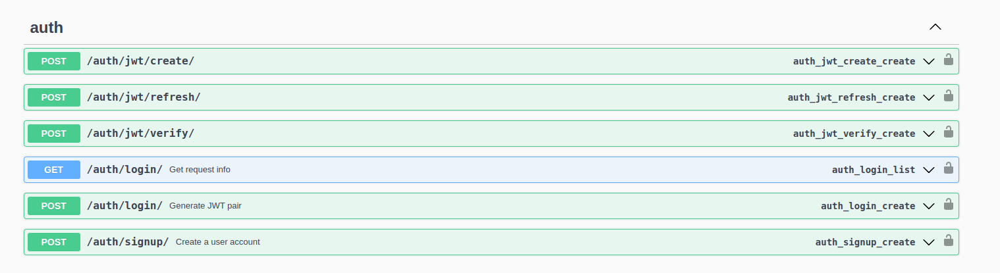
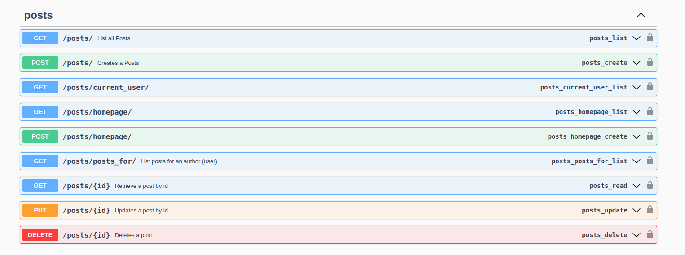

# Blog API

This is a Blog Api

--- --- ---

## installation
Clone the repo
Create and activate virtual environment

Run `pip install -r requirements.txt` on your terminal

Run `python manage.py runserver`

on your browser 'localhost:8000' then enter

